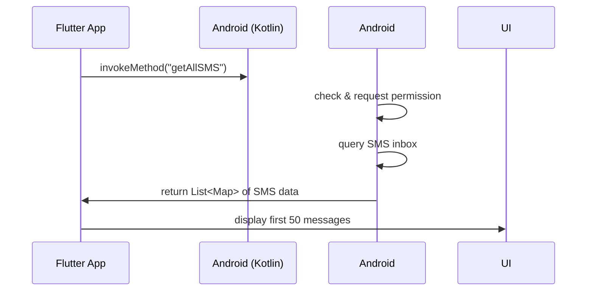

---

# 📩 SMS Reader (Flutter + Native Android)

This Flutter project fetches and displays SMS messages on an Android device that contain the keyword `SIBSMS`. It uses **platform channels** to access native Android functionality for reading SMS.

---

## 🚀 Features

* Fetch all SMS messages from the Android inbox that contain "SIBSMS"
* Platform channel communication between Flutter and native Android
* Permission handling for SMS read access
* Custom native toast notifications
* Displays latest 50 messages in a styled list

---

## 🛠️ Requirements

* Flutter SDK (3.0+ recommended)
* Android Studio or VS Code
* Android device or emulator with SMS capability
* Minimum SDK version: `21`

---
## 📂 Folder Structure

```
lib/
  └── homepage.dart       # Flutter UI & MethodChannel
android/
  └── MainActivity.kt     # Native Android code to read SMS
```

---

## ✅ Permissions Setup

### 1. Add Permission in `AndroidManifest.xml`

Open `android/app/src/main/AndroidManifest.xml` and **add this inside the `<manifest>` tag**:

```xml
<uses-permission android:name="android.permission.READ_SMS"/>
```

Also, ensure this line is present **inside the `<application>` tag** (typically already added by Flutter):

```xml
<application
    android:name="io.flutter.app.FlutterApplication"
    android:label="flow"
    android:icon="@mipmap/ic_launcher">
```

---

### 2. Request Runtime Permission in Code (Handled)

SMS permission is requested at runtime in `MainActivity.kt` using:

```kotlin
ActivityCompat.requestPermissions(
    this,
    arrayOf(Manifest.permission.READ_SMS),
    SMS_PERMISSION_REQUEST_CODE
)
```

---

## 🧠 How It Works

### Flutter (`homepage.dart`)

* Sets up a `MethodChannel` with the name `"uniqueChannel"`
* Invokes method `"getAllSMS"` to trigger native call
* Parses and displays results in a scrollable list

### Android (`MainActivity.kt`)

* Receives `getAllSMS` method calls from Flutter
* Reads SMS messages using `content://sms/inbox`
* Filters only those where the sender contains `"SIBSMS"`
* Returns list of maps to Flutter for display

---

## 🔄 Communication Flow



---

## ▶️ Getting Started

### Run on Device:

```bash
flutter run
```

Make sure the device has SMS messages and grant SMS read permissions when prompted.

---

## ⚠️ Notes

* This app works **only on Android** (iOS does not allow SMS read access).
* The app filters messages using `address LIKE %SIBSMS%` and also checks with `.contains("SIBSMS")`.

---
